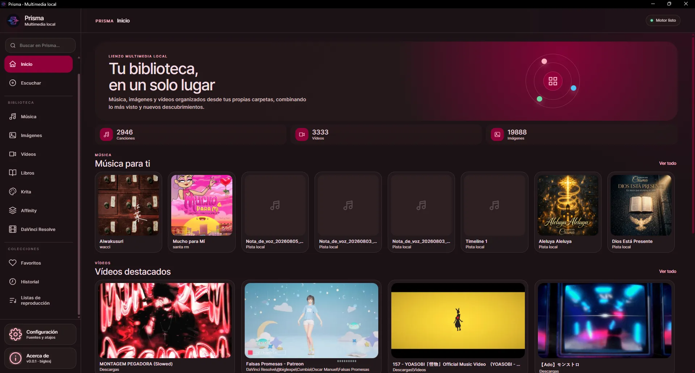
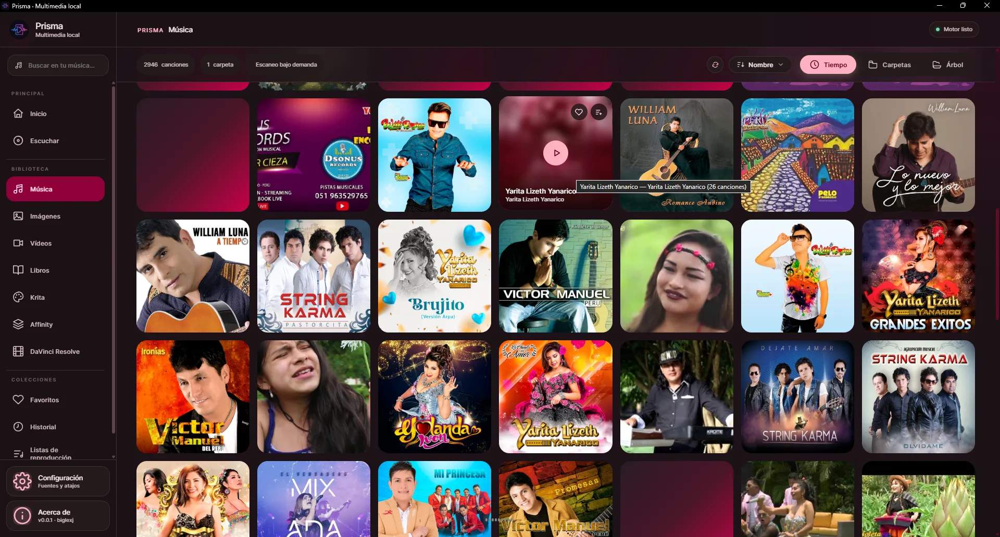
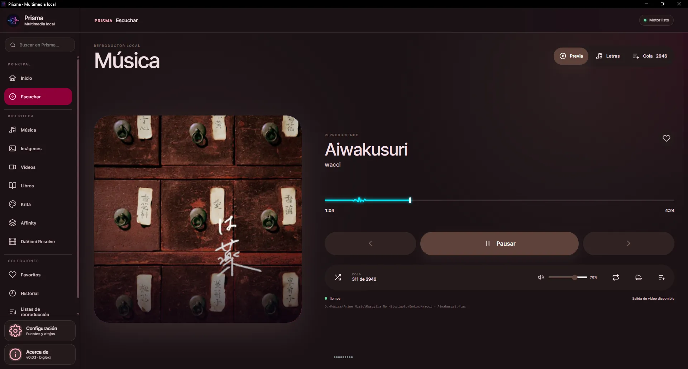
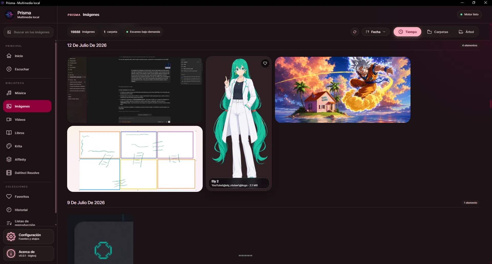
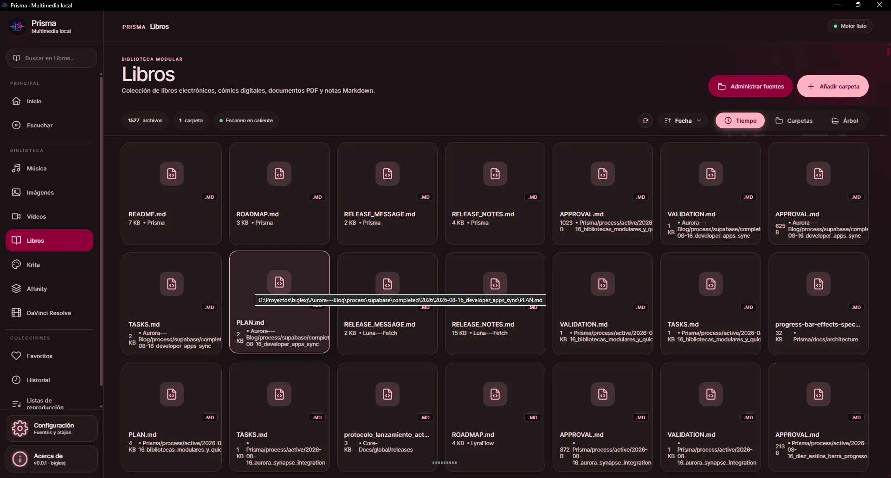
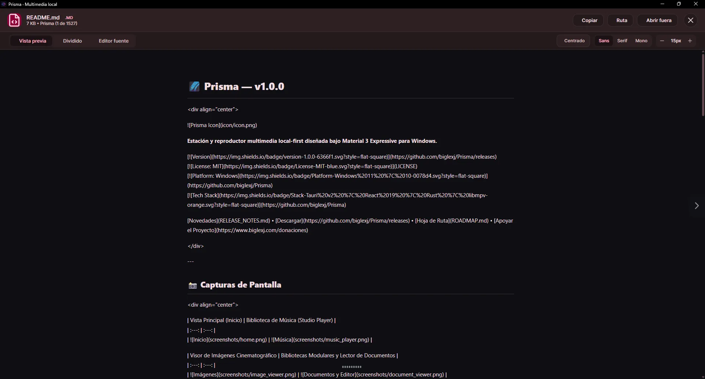
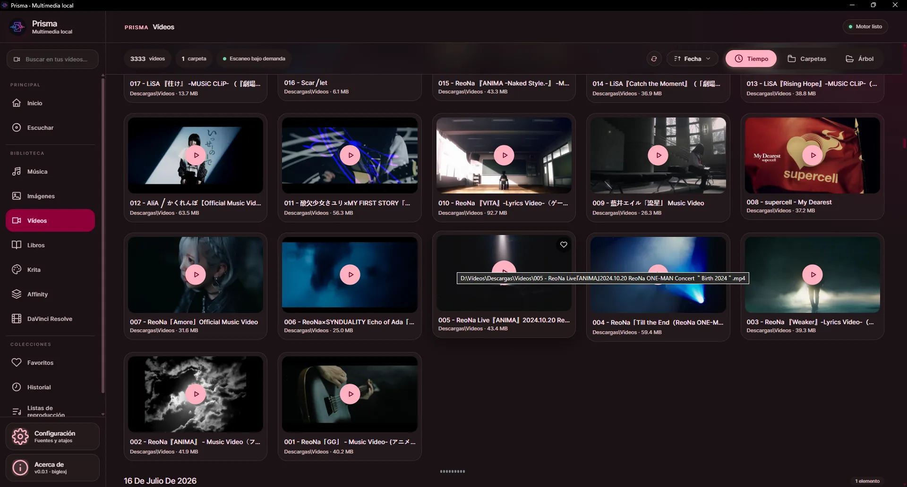
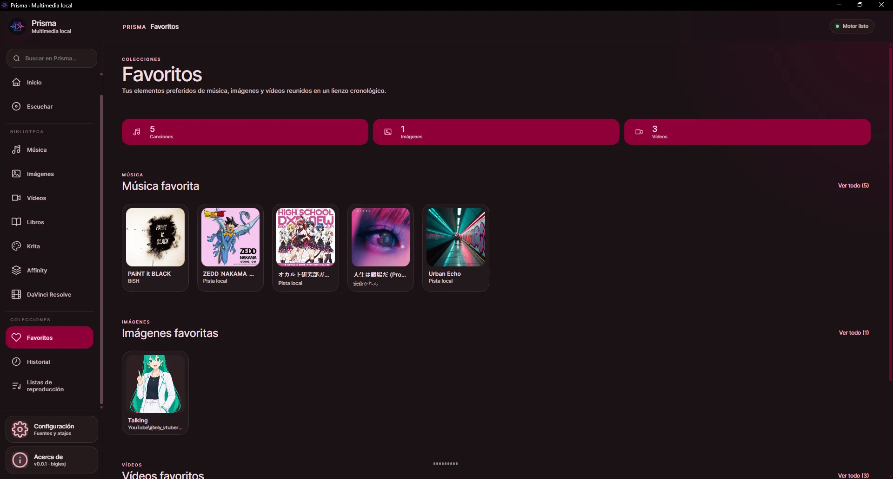
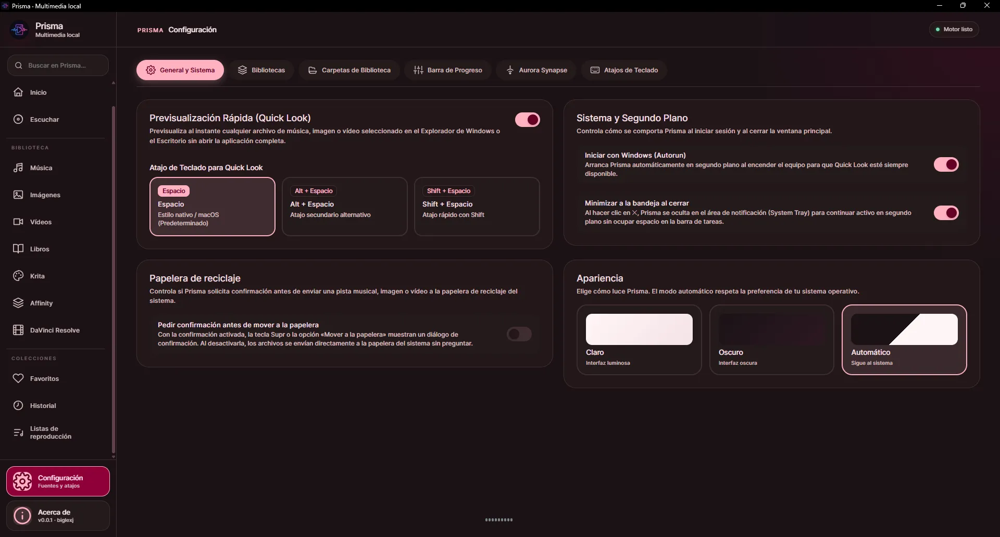
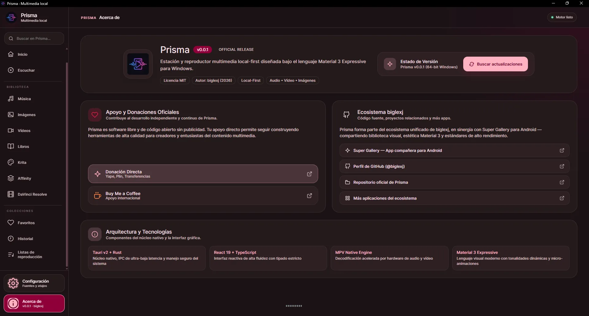

# 🌌 Prisma — v1.0.0

<div align="center">


**Estación y reproductor multimedia local-first diseñada bajo Material 3 Expressive para Windows.**

[](https://github.com/biglexj/Prisma/releases)
[](LICENSE)
[](https://github.com/biglexj/Prisma)
[](https://github.com/biglexj/Prisma)

[Novedades](RELEASE_NOTES.md) • [Descargar](https://github.com/biglexj/Prisma/releases) • [Hoja de Ruta](ROADMAP.md) • [Apoyar el Proyecto](https://www.biglexj.com/donaciones)

</div>

---

## 📸 Capturas de Pantalla

<div align="center">

| Vista Principal (Inicio) | Biblioteca de Música |
| :---: | :---: |
|  |  |

| Reproductor Inmersivo (Now Playing) | Galería de Imágenes |
| :---: | :---: |
|  |  |

| Bibliotecas Modulares (Libros/Docs) | Lector y Editor de Documentos |
| :---: | :---: |
|  |  |

| Reproductor de Vídeo | Colección de Favoritos |
| :---: | :---: |
|  |  |

| Configuración General | Acerca de Prisma |
| :---: | :---: |
|  |  |

</div>

---

## ✨ Características Principales

### 🎵 1. Reproducción de Audio de Alta Fidelidad
- **Motor de Audio Avanzado**: Potenciado por `libmpv` y decode nativo para FLAC, MP3, WAV, AAC, M4A, OGG y OPUS.
- **Studio Player**: Vista inmersiva con carátulas en alta resolución, letras sincronizadas, visualizadores de onda dinámicos y ecualización fluida.
- **Gestión de Colas Inteligente**: Cola de reproducción continua con modos repetición, reproducción aleatoria (*shuffle* determinista) y adición rápida.

### 🎬 2. Reproductor de Vídeo con PiP Adaptativo
- **Proyección Fluida**: Aceleración por hardware para formatos MP4, MKV, WebM, AVI y MOV.
- **Picture-in-Picture (PiP) Nativo**: Ventana flotante compacta que conserva la relación de aspecto original de la fuente sin deformaciones.
- **Controles de Estudio**: Selección instantánea de pistas de audio multilingüe, subtítulos incrustados o externos, velocidad ajustable y avance rápido continuo a 3.0x.

### 🖼️ 3. Galería Visual y Editor de Imágenes
- **Navegación Cinematográfica**: Vista por Línea de Tiempo, Álbumes por Carpetas y Árbol Jerárquico estilo lienzo con fundido suave (*crossfade*) entre imágenes.
- **Zoom y Pan Ultrafluido**: Ampliación continua hasta 500% con navegación por arrastre y ajuste automático al marco.
- **Herramientas de Edición**: Recorte interactivo, rotación, ajuste de brillo/contraste/saturación, filtros tonales y guardado con renombrado seguro.

### 📚 4. Bibliotecas Modulares y Lector de Documentos
- **Secciones Personalizables**: Crea módulos dedicados para Libros/PDFs, Documentos Markdown, Código Fuente o Proyectos de Diseño (Krita `.kra`, Photoshop `.psd`, SVG).
- **Visor In-App y Modo Dividido (*Split View*)**: Lee y edita archivos de texto y código simultáneamente con previsualización en vivo a la derecha.
- **Controles de Lectura Avanzada**: Ajuste suave de línea (*soft-wrap*), numeración de líneas, tabulación inteligente, selector de tipografías (*Sans, Serif, Mono*), atajo `Ctrl + S`, guardado a disco y zoom de 11px a 32px en escala proporcional.

### 👁️ 5. Prisma Quick Look Universal
- **Previsualización Rápida Global**: Pulsa la barra espaciadora en el Explorador de Windows o el Escritorio para abrir al instante cualquier archivo de audio, vídeo, imagen, PDF, Markdown, código o proyecto creativo sin abrir ventanas pesadas.

### 📡 6. Aurora Synapse LAN Remote Control
- **Mando a Distancia Wi-Fi/LAN**: Protocolo de comunicación local de baja latencia para controlar reproducción, volumen, subtítulos y navegación entre fotos y documentos desde cualquier dispositivo móvil o cliente conectado a tu red.
- **Resolución Inteligente de Archivos**: Sincronización transparente de comandos y recepción fluida de medios.

### 🛡️ 7. Aislamiento Estricto de Carpetas Excluidas
- **Privacidad y Limpieza Total**: Las carpetas ignoradas por el usuario y los directorios ocultos del sistema (`.git`, `.gemini`, `.vscode`, `node_modules`, `build`, etc.) quedan automáticamente excluidos de la línea de tiempo, álbumes, árbol y colas de reproducción.

---

## 🛠️ Stack Tecnológico

- **Frontend**: React 19, TypeScript 5.9, Vite 7, CSS Vanilla (Material 3 Expressive Design Tokens).
- **Backend Nativo**: Rust 2024, Tauri v2.
- **Motor Multimedia**: `libmpv2` con enlace nativo en C/Rust y renderizado acelerado.
- **Metadatos de Audio**: Lofty.
- **Procesamiento de Imagen**: `image` crate (JPEG, PNG, WebP, PSD, Krita preview extraction).
- **Instalador Oficial**: NSIS para Windows con compresión LZMA y firma digital.

---

## 🚀 Instalación y Uso

### Descarga del Instalador Oficial (Windows)
Descarga la última versión de **Prisma** desde la sección oficial de [Releases](https://github.com/biglexj/Prisma/releases):
- `Prisma_1.0.0_x64-setup.exe` (Instalador NSIS con inicio automático opcional y bandeja del sistema).

---

## 💻 Desarrollo Local

### Requisitos Previos
1. [Node.js](https://nodejs.org/) v20+ o [Bun](https://bun.sh/) v1.2+
2. [Rust](https://www.rust-lang.org/) v1.85+ (`stable-x86_64-pc-windows-msvc` o `gnullvm`)
3. Dependencias nativas de `libmpv` para Windows.

### Configuración del Entorno
```powershell
# 1. Clonar el repositorio
git clone https://github.com/biglexj/Prisma.git
cd Prisma

# 2. Instalar dependencias de frontend
bun install

# 3. Descargar y vincular binarios de libmpv
powershell -ExecutionPolicy Bypass -File scripts/setup-libmpv.ps1

# 4. Iniciar en modo desarrollo
bun run tauri dev
```

### Compilación y Empaquetado
```powershell
# Compilación para producción (Instalador NSIS)
powershell -ExecutionPolicy Bypass -File ./scripts/release/build-release.ps1 -LocalOnly
```

---

## 💖 Apoyo y Donaciones

Si **Prisma** te resulta útil y deseas apoyar su desarrollo continuo e independiente:

- 💳 **Donaciones Oficiales (Yape, Plin, Transferencias y Web)**: [biglexj.com/donaciones](https://www.biglexj.com/donaciones)
- ☕ **Buy Me a Coffee (Internacional)**: [buymeacoffee.com/biglexj](https://buymeacoffee.com/biglexj)
- ⭐ **GitHub**: Dale una estrella al repositorio en [github.com/biglexj/Prisma](https://github.com/biglexj/Prisma)

---

## 📄 Licencia

Este proyecto está licenciado bajo los términos de la licencia **MIT**. Consulta el archivo [LICENSE](LICENSE) para más detalles.

**Autor**: [Biglex J](https://github.com/biglexj) (2026)
